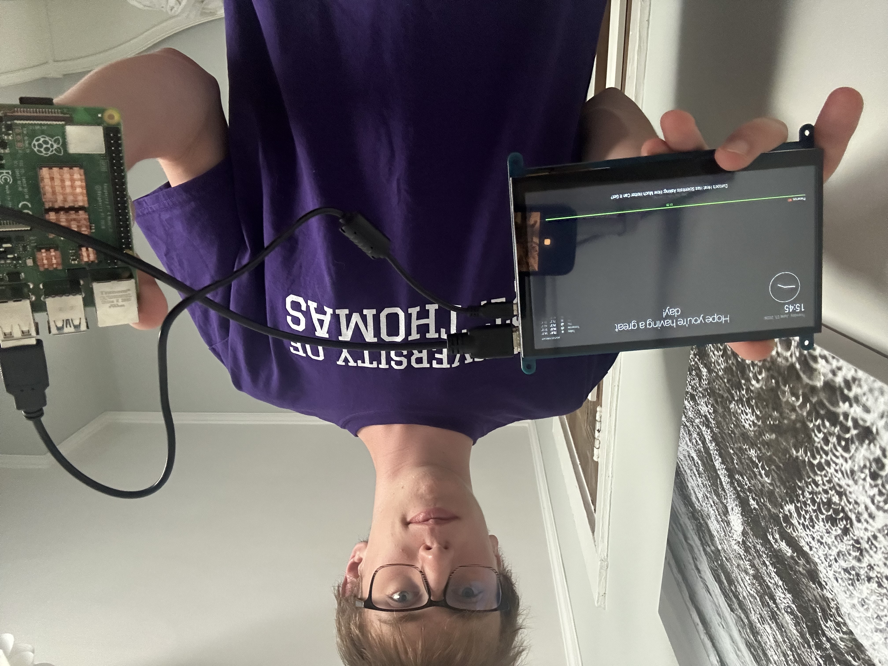

# Magic Mirror
The project I chose to do is the magic mirror, which is essentailly a rapsberry pi with node.js that shows a screen that has the time, weather, and other usefull things. I chose to do this project so I can use the product as an alternative for my phone. 


| **Engineer** | **School** | **Area of Interest** | **Grade** |
|:--:|:--:|:--:|:--:|
| Aidan S. | Oak Park and River Forest High School | Mechanical Engineering | Incoming Senior



  
# Second Milestone

<iframe width="560" height="315" src="https://www.youtube.com/embed/XK0VLb3TVcc?si=tWeA7AaUbEk5-gO5" title="YouTube video player" frameborder="0" allow="accelerometer; autoplay; clipboard-write; encrypted-media; gyroscope; picture-in-picture; web-share" referrerpolicy="strict-origin-when-cross-origin" allowfullscreen></iframe>

For my second milestone, I added a feature to the magic mirror that allowed the mirror to turn off after a 2 minute timer ended. My biggest challenge in the process of working on this project came when I was trying to figure out how to use motion sensors to turn on and off my mirror. Unfortunately, they did not end up working. Hopefully I can come back to this project and figure them out. The other challenges came when trying to upload the Javascript on day one and I was easily able to fix them because they were simply outdated lines and I just replaced them with newer versions that supported my pi's version. At BSE I learned a lot about how to use a raspberry pi to create a project, which was really fun. I hope now to use raspberry pi's to create other projects in the future.

# First Milestone

<iframe width="560" height="315" src="https://www.youtube.com/embed/1oT3m4xKQ28?si=u0axokpFt0taX8kL" title="YouTube video player" frameborder="0" allow="accelerometer; autoplay; clipboard-write; encrypted-media; gyroscope; picture-in-picture; web-share" referrerpolicy="strict-origin-when-cross-origin" allowfullscreen></iframe>

My project is a magic mirror that provides the date, time, weather, news, and more. I uploaded and ran a program on a raspberry pi computer to display the mirror on a monitor. Later on I will integrate motion detectors to automatically turn on the display when there is motion, and turn off the display after no detected motion for a short period of time to conserve energy. I also plan to add a frame to make it look more pretty.

# Code
Here's where you'll put your code. The syntax below places it into a block of code. Follow the guide [here]([url](https://www.markdownguide.org/extended-syntax/)) to learn how to customize it to your project needs. 

```{
			module: "weather",
			position: "top_right",
			header: "Weather Forecast",
			config: {
				weatherProvider: "openmeteo",
				type: "forecast",
				lat: 41.869102,
				lon: -87.789902
			}
		},
		{
			module: "newsfeed",
			position: "bottom_bar",
			config: {
				feeds: [
					{
						title: "New York Times",
						url: "https://rss.nytimes.com/services/xml/rss/nyt/HomePage.xml"
					}
				],
				showSourceTitle: true,
				showPublishDate: true,
				broadcastNewsFeeds: true,
				broadcastNewsUpdates: true
			}
		},
                   {
 module: "compliments",
    position: "top_center",  // or top_bar, bottom_bar, etc.
    config: {
        compliments: {
            morning: [
                "Good morning!",
                ":)"
            ],
            afternoon: [
                "Hello!",
                "Hope you're having a great day!",
":)"
            ],
            evening: [
                "Good evening!",
                ":)",
"go to bed"
            ]
        }
        // You can also add updateInterval, fadeSpeed, etc.
    }
}
	]
};

//I edited this portion of the config.js file to change up what modules I used and their positions
```

# Bill of Materials

| **Part** | **Note** | **Price** | **Link** |
|:--:|:--:|:--:|:--:|
| Raspberry pi 4 kit | computer runs the program to show the mirror | $147.79 | <a href="https://www.amazon.com/RasTech-Raspberry-Starter-Heatsink-Screwdriver/dp/B0C8LV6VNZ?th=1"> Link </a> |
| Wireless keyboard and mouse | Used to control the raspberry pi and run the program | $19.99 | <a href="https://www.amazon.com/Wireless-Keyboard-MARVO-Ergonomic-Compatible/dp/B09P33RWFJ/ref=sr_1_8?crid=25NZHWHJCCIRD&dib=eyJ2IjoiMSJ9.CM5cH1es5BlyFktB1Vxilllr0GbyvUQicyIGHEoVMN48koGBB4W65cZI_1H2q92yKd5_fpnd930q_3UerO24pIF6pdZip6_SQ6Il27zBX9MA1x2A9-n7CNykZa4EPSitgeYhmTzpXSBa3o2k3_S_E97l79BQEp1qunXNSVk1_PicqHudGgKgkrllQS7vokvqnkGDoPLnbvqzgPIXekwHd2ubXzOCZYISrfTiobaE11uCsMxLJmBGacsZcCD9jPno4j5jr3YAD6LH27YuPKInv4YJ5HRbEPGFg1Po9YNknbs.LuRKWFF1zq8wm3HIkvonUc5Jeupk3PiCaeMXJvTHcBY&dib_tag=se&keywords=wireless%2Bmouse%2Band%2Bkeyboard&qid=1779915988&sprefix=wireless%2Bmouse%2Band%2Bke%2Caps%2C606&sr=8-8&th=1"> Link </a> |
| 7 inch lcd display | used for display of the magic mirror | $45.99 | <a href="https://www.amazon.com/Hosyond-Display-1024%C3%97600-Capacitive-Raspberry/dp/B09XKC53NH?th=1"> Link </a> |


# Other Resources/Examples
- [timer github](https://github.com/rkorell/MMM-PresenceScreenControl/blob/main/README.md)
- [Magic Mirror sparkfun](https://learn.sparkfun.com/tutorials/how-to-make-a-magic-mirror-with-raspberry-pi/all)
